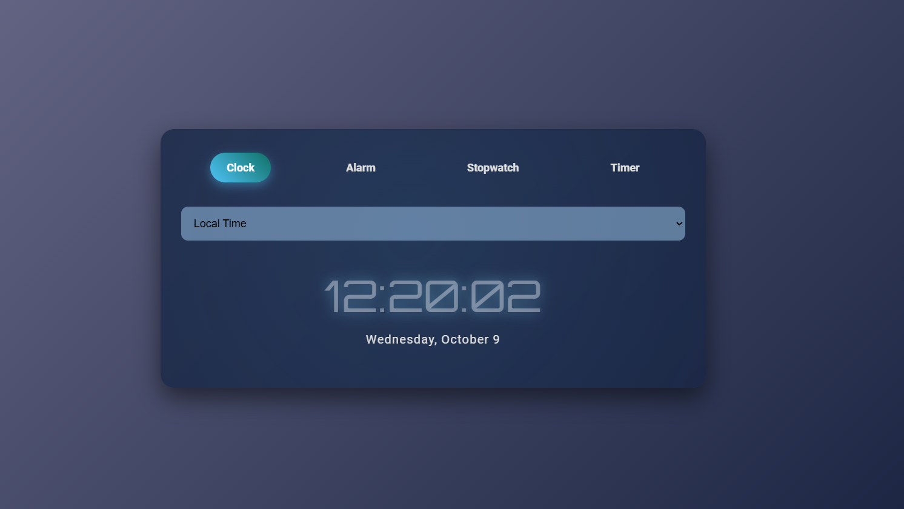

# Global Time Management Tool

## Introduction
This project was developed for the Ideathon 2.0 competition at our college, where we secured first place! 🎉 We are a group of four students, and our team name is **JustForFun**. The competition was a coding relay, where each team member had 15 minutes to code, followed by a 5-minute handover period.

## Project Overview
The Global Time Management Tool is a comprehensive solution designed to help users manage their time effectively across different time zones. It includes features such as a functional clock, alarm system, and more. The project is implemented using HTML, CSS, and JavaScript.

## Features
- **Functional Clock**: Displays the current time in various time zones.
- **Alarm System**: Allows users to set alarms for different time zones.
- **User-Friendly Interface**: Easy-to-navigate interface with a clean design.
- **Responsive Design**: Works seamlessly on both desktop and mobile devices.
- **Web to App Conversion**: The web application has been converted into a mobile app using the WebToApp tool. The APK of the app is provided in the GitHub repository and can be downloaded directly.

## Installation
To run the project locally, follow these steps:

1. Clone the repository:
    ```bash
    git clone https://github.com/sohan10012/Hacksprint-JustForFun.git
    ```
2. Open `index.html` in your preferred web browser.

## Usage
- **Clock**: The clock will automatically display the current time in various time zones.
- **Set Alarm**: Use the alarm feature to set alarms for different time zones. The alarm will play a sound when it goes off.
- **Stopwatch** : Use stopwatch to set the stopwatch functionality.
- **Set Timer** :Timer can set using timer functionality.

## Technologies Used
- **HTML**: For structuring the project.
- **CSS**: For styling the project (linked as `styles.css`).
- **JavaScript**: For adding interactivity (linked as `script.js`).  

## APK Download
The mobile app version of this project can be downloaded from the GitHub repository. Download the APK

## Screenshots



## Team Members
- **Member 1**: sohan10012
- **Member 2**: Shreesha2205
- **Member 3**: prajwalshetty-19
- **Member 4**: Tusharr06

## Acknowledgements
We would like to thank our mentors and peers for their support and feedback throughout the development of this project.

---

Feel free to reach out if you have any questions or need further assistance!
